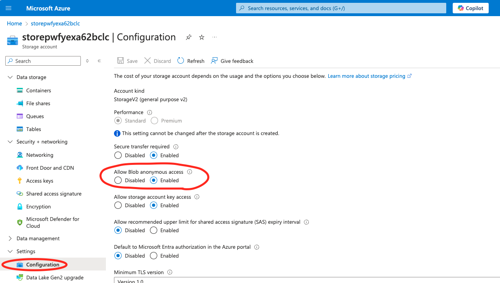
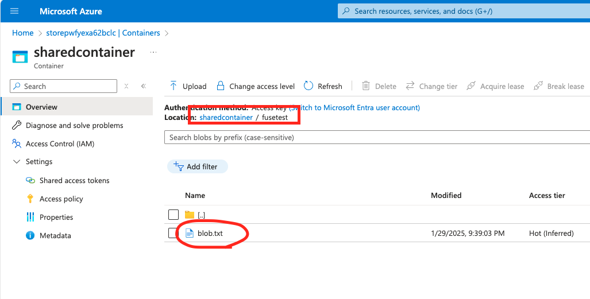

# Bicepを使ったAzure Virtual NetworkとVirtual Machineの作成手順例

本リポジトリのコードを使って、Azureの任意のリージョンにVNetを1つ、そのなかにサブネットを10こ、ストレージアカウントを1つ作成し、各サブネットにVMを1台ずつ、それぞれにPublic IPを付与した状態で作成する手順を示します。

## 免責、Disclaimer

本記事はあくまで筆者の検証環境での結果に基づいた記述であり、読者の環境で同じ操作を行った場合に必ず同じ環境の構築が成功することを約束するものではありません。あくまで参考資料としてご利用ください。

## 前提条件、利用ツール

### 前提条件

本リポジトリで示す手順はサブスクリプションの所有者ロールを割り当てられたアカウントで実行することを前提としています。

本作業例はmacOS 15.2のzshで動作を確認しています。

本作業ではVMを作成し管理者アカウントでログイン、データディスクのフォーマットとマウント、Infinibandドライバーのインストール、IP over InfinibandでのVM間相互通信までを行います。

すべてのVMで同じ公開鍵を登録します。

管理者以外のアカウントの作成やその他の設定は対象外です。

### 利用ツール

ツールは以下のものを利用します。
- [Git](https://git-scm.com/)
- [Visual Studio Code](https://learn.microsoft.com/ja-jp/azure/azure-resource-manager/bicep/install#azure-cli)
- [Azure CLI](https://learn.microsoft.com/ja-jp/azure/azure-resource-manager/bicep/install#azure-cli)
- [Bicep CLI](https://learn.microsoft.com/ja-jp/azure/azure-resource-manager/bicep/install#azure-cli)

作業に入る前にあらかじめAzureサブスクリプションの作成、利用するリージョンおよびVMのSKUのクォータを確保しておいてください。本リポジトリのコードでは以下の値でVMを作成します。

- リージョン: リソースグループを作成する際に指定
- vmType (Bicepのパラメータとして設定された変数で以下の3種類があり、この値によってVM SKU、VMイメージが決定される):
    - General: 
        - VM SKU: [Dadsv5シリーズ Standard_D2ads_v5](https://learn.microsoft.com/ja-jp/azure/virtual-machines/sizes/general-purpose/dadsv5-series?tabs=sizebasic)
        - VMイメージ: Canonical:ubuntu-24_04-lts:server:latest
    - HPC:
        - VM SKU: [NDv2シリーズ Standard_ND40rs_v2](https://learn.microsoft.com/ja-jp/azure/virtual-machines/sizes/gpu-accelerated/ndv2-series?tabs=sizebasic)
        - VMイメージ: microsoft-dsvm:ubuntu-hpc:2204:22.04.2024102301
    - HPC2:
        - VM SKU: [ND-H100-v5シリーズ Standard_ND96isr_H100_v5](https://learn.microsoft.com/ja-jp/azure/virtual-machines/sizes/gpu-accelerated/ndh100v5-series?tabs=sizebasic)
        - VMイメージ: microsoft-dsvm:ubuntu-hpc:2204:22.04.2024102301
- OSディスク: Premium SSD LRS
- データディスク: Premium SSD LRS 1TB
- NIC: Public IPを付加

本リポジトリのコードを修正し、任意のVMのSKU、イメージを利用することが可能です。

## 作業の流れ

作業は以下の順に実行します。

1. VM作成事前作業 (ここまではAzureの費用なしに可能)
    1. [本リポジトリのクローン](#1-i-本リポジトリのクローン)
    2. [リソースグループの作成](#1-ii-リソースグループの作成)
    3. [VNet及び各VM用のサブネット、ストレージアカウントの作成](#1-iii-vnet及び各vm用のサブネットストレージアカウントの作成)
    4. [各VMログイン用のキーペアの作成 (未作成の場合)](#1-iv各vmログイン用のキーペアの作成-未作成の場合)

2. VM作成作業 (ここから費用が発生)
    1. [VMの作成、パブリックIPの割当、データディスクのアタッチ](#2-i-vmの作成パブリックipの割当データディスクのアタッチ)
    2. [ログイン確認](#2-ii-ログイン確認)

3. 通常のVMとしての作業
    1. [データディスクのフォーマットとマウント](#3-i-データディスクのフォーマットとマウント)
    2. [BlobFuse2を使ったBlob Storageのマウント](#3-ii-blob-storageのコンテナのマウント-各vmでblob-storageをマウントして利用する場合)

3. HPC用作業
    1. [Infinibandドライバーのインストール、有効化](#4-i-infinibandドライバーのインストール有効化)
    2. [IP over InfinibandでのVM相互通信テスト](#4-ii-ip-over-infinibandでのvm相互通信テスト)

## VM作成事前作業

### 1-i. 本リポジトリのクローン

作業端末で本リポジトリをクローンします。

```shell
git clone https://github.com/hironariy/VnetAndVmCreationWithBicep.git
```

### 1-ii. リソースグループの作成

Azure CLIにログインします。

```shell
az login
```

必要に応じて作業対象のサブスクリプションに移動します。

```shell
# ログインしたアカウントで利用可能なサブスクリプションの表示
az account show --output table

# アクティブなサブスクリプションの設定
az account set --subscription <サブスクリプション名 or サブスクリプションID>
```

サブスクリプション内にリソースグループを作成します。

```shell
az group create --name <任意のリソースグループ名> --location <任意のリージョン>
# 代表的なリージョン
# japaneast 東日本
# australiaeast オーストラリア東部
# westeurope ヨーロッパ西部
```
### 1-iii. VNet及び各VM用のサブネット、ストレージアカウントの作成

本リポジトリのコードを使ってVNet、その中のサブネット、ストレージアカウントを作成します。

```shell
az deployment group create -g <リソースグループ名> --template-file VnetAndSaCreation.bicep --name vnetDeployment
```

コマンド実行後にサブネット作成数を入力します。後に作成するVMと同じ数にします。

```shell
#  作成するサブネットの数を入力。最小 1、最大 10
Please provide int value for 'subnetCount' (? for help): <1から10までの任意の整数>
```

VNetとストレージアカウントが作成されたことを確認します。
サブネットはVNetのプロパティのため、リソースが表示されるここでは表示されません。

```shell
az resource list -g <リソースグループ名> -o table

#表示例
Name                ResourceGroup    Location       Type                               Status
------------------  ---------------  -------------  ---------------------------------  --------
storeexample        exampleRg    region-name  Microsoft.Storage/storageAccounts
BicepVNet           exampleRg    region-name  Microsoft.Network/virtualNetworks
```

作成したストレージアカウントとBlob Storageのコンテナの名前を確認します。

```shell
az deployment group show --resource-group <リソースグループ名> --name vnetDeployment --query properties.outputs
```
出力例
```json
{
  "blobContainerName": {
    "type": "String",
    "value": "<BlobStorageコンテナ名>"
  },
  "blobServiceName": {
    "type": "String",
    "value": "<BlobStorageサービス名>"
  },
  "storageAccountName": {
    "type": "String",
    "value": "<ストレージアカウント名>"
  }
}

```

あとでBlobfuse2でVMからBlob Storageをマウントするときに利用するので、Blob Storageの接続文字列を出力し、メモしておきます。

```shell
az storage account show-connection-string -g competitionRg -n <ストレージアカウント名>
#出力例
{
  "connectionString": "DefaultEndpointsProtocol=https;EndpointSuffix=core.windows.net;AccountName=xxxxxxxxxx;AccountKey=Jixxxxxxxxxxxxxxx;BlobEndpoint=https://xxxxxxxxxx.blob.core.windows.net/;FileEndpoint=https://xxxxxxxxxx.file.core.windows.net/;QueueEndpoint=https://xxxxxxxxxx.queue.core.windows.net/;TableEndpoint=https://xxxxxxxxxx.table.core.windows.net/"
}
```

### 1-iv.　各VMログイン用のキーペアの作成 (未作成の場合)

VMの管理者アカウント用のsshキーペアを作成していない場合は作成します。

```shell
ssh-keygen -t rsa -b 4096  
```

## VM作成作業

> [!Note]
> HPCをつかってIP over Infinibandでの通信を考えている方へ
> IP over Infinibandを使ってHPC VM間での通信を行う場合はVMの場合は通信するVMが同一可用性セット内(Fault DomainやUpdate Domainは別れても良い)であること、VMSSの場合はsinglePlacementGroupプロパティがtrueである必要があります。
> 本リポジトリのBicepでは一つの可用性セットにすべてのVMが立ち上がるように構成されているので特に個別の設定は必要ありませんが、通信可能範囲を分割したり、自分でBicepを組み立てる場合はご注意ください。
> 詳細は[こちら](https://learn.microsoft.com/ja-jp/azure/virtual-machines/setup-infiniband#cluster-configuration-options)をご確認ください。

### 2-i. VMの作成、パブリックIPの割当、データディスクのアタッチ

VM作成用のBicepを利用してVMやディスク、PublicIPを作成します。

```shell
az deployment group create -g <リソースグループ名> --template-file VmCreation.bicep --name vmDeployment   
```

```shell
Please provide string value for 'vmType' (? for help): 
 [1] General
 [2] HPC
 [3] HPC2
Please enter a choice [Default choice(1)]:  <作成するVM Type番号>
Please provide int value for 'vmCount' (? for help): <サブネットと同じ整数>
Please provide string value for 'adminUsername' (? for help): <管理者アカウント名>
Please provide string value for 'authenticationType' (? for help): 
 [1] sshPublicKey
 [2] password
Please enter a choice [Default choice(1)]: 1 #本サンプルでは公開鍵を利用
Please provide securestring value for 'adminPasswordOrKey' (? for help): <登録する公開鍵の文字列>
```

作成されたリソースを確認します。

```shell
az resource list -g <リソースグループ名> -o table
```
### 2-ii. ログイン確認

先ほど利用したデプロイメントからoutputsを確認します。

```shell
az deployment group show --resource-group <リソースグループ名> --name vmDeployment --query properties.outputs
```

出力例

```json
{
  "adminUsername": {
    "type": "String",
    "value": "<管理者アカウント名>"
  },
  "hostname": {
    "type": "Array",
    "value": [
      "<vm1名>.<リージョン名>.cloudapp.azure.com",
      "<vm2名>.<リージョン名>.australiaeast.cloudapp.azure.com"
    ]
  },
  "sshCommand": {
    "type": "Array",
    "value": [
      "<VM1接続用sshコマンド>",
      "<VM2接続用sshコマンド>"
    ]
  }
}
```

outputsに出力されるssh接続コマンドを使って各VMに接続します。

```shell
#出力されたコマンドに-iオプションを付与し秘密鍵を指定します。
ssh <管理者アカウント名>@<VM名> -i <ssh接続用秘密鍵>
```

## 通常のVMとしての作業

### 3-i. データディスクのフォーマットとマウント

sshでVMにログインし、ディスクがアタッチされていることを確認します。
下記の例だとsdbという名前で接続されています。

```shell
rootAccountName@vmName:~$ lsblk
NAME    MAJ:MIN RM  SIZE RO TYPE MOUNTPOINTS
sda       8:0    0   30G  0 disk 
├─sda1    8:1    0   29G  0 part /
├─sda14   8:14   0    4M  0 part 
├─sda15   8:15   0  106M  0 part /boot/efi
└─sda16 259:0    0  913M  0 part /boot
sdb       8:16   0    1T  0 disk 
sr0      11:0    1  628K  0 rom 
```

今回はパーティション分割せずにディスクにファイルシステムを作成します。

```shell
rootAccountName@vmName:~$ sudo mkfs.ext4 /dev/sdb
mke2fs 1.47.0 (5-Feb-2023)
Discarding device blocks: done                            
Creating filesystem with 268435456 4k blocks and 67108864 inodes
Filesystem UUID: 51a34127-b69b-4c53-a9c7-c0431b90367a
Superblock backups stored on blocks: 
        32768, 98304, 163840, 229376, 294912, 819200, 884736, 1605632, 2654208, 
        4096000, 7962624, 11239424, 20480000, 23887872, 71663616, 78675968, 
        102400000, 214990848

Allocating group tables: done                            
Writing inode tables: done                            
Creating journal (262144 blocks): done
Writing superblocks and filesystem accounting information: done  
```

データディスクをマウントします。

```shell
rootAccountName@vmName:~$ sudo mkdir /datadrive
rootAccountName@vmName:~$ sudo mount /dev/sdb /datadrive
```

マウントされたことを確認します。

```shell
rootAccountName@vmName:~$ lsblk
NAME    MAJ:MIN RM  SIZE RO TYPE MOUNTPOINTS
sda       8:0    0   30G  0 disk 
├─sda1    8:1    0   29G  0 part /
├─sda14   8:14   0    4M  0 part 
├─sda15   8:15   0  106M  0 part /boot/efi
└─sda16 259:0    0  913M  0 part /boot
sdb       8:16   0    1T  0 disk /datadrive
sr0      11:0    1  628K  0 rom  
```

再起動後にドライブがマウントされるようにそのドライブを/etc/fstabファイルに追加します。事前作業としてblkidでディスクのUUIDを取得します。

```shell
sudo -i blkid
```

出力例

```shell
/dev/sda16: LABEL="BOOT" UUID="a1f941e3-782c-4e21-ba31-97e0f6fcb50c" BLOCK_SIZE="4096" TYPE="ext4" PARTUUID="fa54c6a9-6293-42d8-8453-11079fe5eec1"
/dev/sda15: LABEL_FATBOOT="UEFI" LABEL="UEFI" UUID="C30D-3EEB" BLOCK_SIZE="512" TYPE="vfat" PARTUUID="7ccbd9ff-7523-46a4-b138-68a3c6efcb31"
/dev/sda1: LABEL="cloudimg-rootfs" UUID="61bdcf85-9086-4bfd-9faf-225cb7bf06be" BLOCK_SIZE="4096" TYPE="ext4" PARTUUID="8be7931c-8315-4344-95d4-bcbd379998fb"
/dev/sdb: UUID="51a34127-b69b-4c53-a9c7-c0431b90367a" BLOCK_SIZE="4096" TYPE="ext4"
/dev/sda14: PARTUUID="be23fb2f-458b-4d03-aef4-fb30182ba8ea"
```

テキストエディタで/etc/fstabファイルを開きます。

```shell
sudo vim /etc/fstab
```

次のような行をファイルに追記します。UUIDは環境に合わせて変更します。

```shell
UUID=51a34127-b69b-4c53-a9c7-c0431b90367a   /datadrive  ext4    defaults,nofail   1  2
```

### 3-ii. Blob Storageのコンテナのマウント (各VMでBlob Storageをマウントして利用する場合)

[BlobFuse2のドキュメント](https://learn.microsoft.com/ja-jp/azure/storage/blobs/blobfuse2-how-to-deploy?tabs=Ubuntu)を参考に各VMにBlobfuse2をMSのパッケージリポジトリからインストールします。

最初にリポジトリを構成し、関連するパッケージをインストールします。

```shell
# Generalの場合
sudo wget https://packages.microsoft.com/config/ubuntu/24.04/packages-microsoft-prod.deb

# HPC, HPC2の場合
sudo wget https://packages.microsoft.com/config/ubuntu/22.04/packages-microsoft-prod.deb

# 以降は共通
sudo dpkg -i packages-microsoft-prod.deb
sudo apt-get update
sudo apt-get install libfuse3-dev fuse3
```

次にBlobFuse2をインストールします。

```shell
sudo apt-get install blobfuse2
```

BlobFuse2用の各ディレクトリを作成します。

```shell
sudo mkdir /datadrive/blobfusecache #データディスクにキャッシュ領域となるディレクトリを作成
sudo chmod 777 /datadrive/blobfusecache
sudo mkdir /sharedblobcontainer
sudo chmod 777 /sharedblobcontainer
mkdir blobfuse2 #ホームディレクトリに作業用ディレクトリを作成
cd blobfuse2 #作業用ディレクトリに移動
```

BlobFuse2用のconfigファイルを作成し、本リポジトリのconfig.yamlをコピー、ストレージアカウント名、アカウントキーを環境に合わせて変更します。

```shell
touch config.yaml
sudo vim config.yaml #本リポジトリのconfig.yamlをコピー、ストレージアカウント名、アカウントキーを環境に合わせて変更
```

まだBlobFuse2をつかってマウントされていないことを確認します。

```shell
blobfuse2 mount list
#何も出力されないことを確認
```

先ほど作成したディレクトリにマウントします。

```shell
blobfuse2 mount /sharedblobcontainer --config-file=./config.yaml
```

マウントしたディレクトリにファイルを作成してみます。

```
$mkdir /sharedblobcontainer/fusetest
$echo "hello world" > /sharedblobcontainer/fusetest/blob.txt
```

> [!Note]
> 本リポジトリのBicepではストレージアカウントのBlobへの[Public Access(匿名アクセス)](https://learn.microsoft.com/ja-jp/azure/storage/blobs/anonymous-read-access-configure?tabs=portal)が無効化されているのでAzure PortalでBlob Storageにディレクトリとファイルが作成されたかを確認する場合は、その設定を有効にし直します。
> 
>  
>
> するとAzure PortalでもBlob Storageにファイルが反映されていることが確認できます。
> 
>
> ストレージアカウントの匿名アクセス設定(Public Access)とBlob Storageのコンテナのアクセスレベルの関係の詳細は[こちらのドキュメント](https://learn.microsoft.com/ja-jp/azure/storage/blobs/anonymous-read-access-prevent?tabs=portal#about-anonymous-read-access)と[こちらのドキュメント](https://learn.microsoft.com/ja-jp/azure/storage/blobs/anonymous-read-access-prevent?tabs=portal#set-the-storage-accounts-allowblobpublicaccess-property-to-false)を確認。

## HPC用作業

### 4-i. Infinibandドライバーのインストール、有効化

本リポジトリのHPC、HPC2のvmTypeではInfinibandドライバーがインストール、有効化されたイメージをあらかじめ利用しているため特に作業は必要ありません。[(参考)](https://learn.microsoft.com/ja-jp/azure/virtual-machines/azure-hpc-vm-images)

任意のVMイメージを利用し、個別にドライバーをインストール、有効化する場合は[こちらのドキュメント](https://learn.microsoft.com/ja-jp/azure/virtual-machines/extensions/hpc-compute-infiniband-linux)をご確認ください。

### 4-ii. IP over InfinibandでのVM相互通信テスト

AzureのInfiniband対応VMでは同一可用性セット内のVM同士で通信できるようになります。本リポジトリのHPC、HPC2のvmTypeではIPoIBもあらかじめ有効化されており、起動時にIPoIBインターフェースに対して自動でIPアドレスが割り振られて、同一可用性セット内の他のVMのIPoIBインターフェースと通信することが可能です。

```shell
# HPC VMにSSHでログインしたところ
$ ifconfig -a
~~~
ib0: flags=4163<UP,BROADCAST,RUNNING,MULTICAST>  mtu 2044
        inet 172.16.1.52  netmask 255.255.0.0  broadcast 0.0.0.0 #IPアドレスが割り振られていることがわかる。
        inet6 fe80::215:5dff:fd33:ff3d  prefixlen 64  scopeid 0x20<link>
        unspec 00-00-01-47-FE-80-00-00-00-00-00-00-00-00-00-00  txqueuelen 256  (UNSPEC)
        RX packets 0  bytes 0 (0.0 B)
        RX errors 0  dropped 0  overruns 0  frame 0
        TX packets 12  bytes 928 (928.0 B)
        TX errors 0  dropped 0 overruns 0  carrier 0  collisions 0
```

```shell
$ ping 172.16.1.52 #他HPC VMのIPoIBインターフェースのIPアドレス
PING 172.16.1.52 (172.16.1.52) 56(84) bytes of data.
64 bytes from 172.16.1.52: icmp_seq=1 ttl=64 time=0.042 ms
64 bytes from 172.16.1.52: icmp_seq=2 ttl=64 time=0.039 ms
64 bytes from 172.16.1.52: icmp_seq=3 ttl=64 time=0.045 ms
64 bytes from 172.16.1.52: icmp_seq=4 ttl=64 time=0.025 ms
64 bytes from 172.16.1.52: icmp_seq=5 ttl=64 time=0.027 ms
^C
--- 172.16.1.52 ping statistics ---
5 packets transmitted, 5 received, 0% packet loss, time 4097ms
rtt min/avg/max/mdev = 0.025/0.035/0.045/0.008 ms
```


